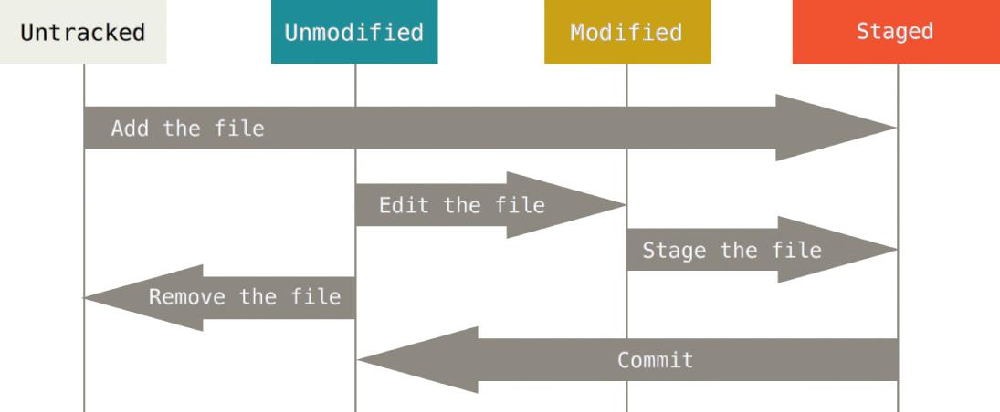

#Gulp watch works

##Git Essentials

###Git Term List
___
Git Term | Description
:---|:---
Git SCM     |Version Control System
Repository | Repo
Branch | Branch
Change Set | Set of changes

##Git common commands used in various situations:
___
###start a working area
git | workflow
:---|:---
clone|      Clone a repository into a new directory
init |      Create an empty Git repository or reinitialize an existing one

###work on the current change (see also: git help everyday)
___
git | workflow
:---|:---
add |       Add file contents to the index
mv |         Move or rename a file, a directory, or a symlink
reset |      Reset current HEAD to the specified state
rm |         Remove files from the working tree and from the index

###examine the history and state (see also: git help revisions)
___
git | workflow
:---|:---
bisect     Use binary search to find the commit that introduced a bug
grep       Print lines matching a pattern
log        Show commit logs
show       Show various types of objects
status     Show the working tree status

###grow, mark and tweak your common history
___
git | workflow
:---|:---
   branch  |   List, create, or delete branches
   checkout|   Switch branches or restore working tree files
   commit |    Record changes to the repository
   diff     |  Show changes between commits, commit and working tree, etc
   merge   |   Join two or more development histories together
   rebase  |   Forward-port local commits to the updated upstream head
   tag     |   Create, list, delete or verify a tag object signed with GPG

###collaborate (see also: git help workflows)
___
git | workflow
:---|:---
   fetch |     Download objects and refs from another repository
   pull   |    Fetch from and integrate with another repository or a local branch
   push |      Update remote refs along with associated objects

###Git Workflow;
git command | git workflow step
-----------------|-----------------------
git init |initializes a user directory for git version control (only once)
git add remote
git add .| adds all created or modified files to staging area
git commit -m "message" | collects staged files into a changeset.

###Git init - starts the git workflow
Create an empty Git repository or reinitialize an existing one

This command creates an empty Git repository.
A subdirectory with the name .git directory is created. With this .git directory subdirectories for objects, refs/heads, refs/tags, and template files are created.

Running git init in an existing repository is safe. It will not overwrite things that are already there. The primary reason for rerunning git init is to pick up newly added templates (or to move the repository to another place if --separate-git-dir is given).

The Git directory is where Git stores the metadata and object database for your project. This is the most important part of Git, and it is what is copied when you clone a repository from another computer.

##The 3 Git Directories
###Working directory: \mydir initialized with git init
The working directory is a single checkout of one version of the project. These files are pulled out of the compressed database in the Git directory and placed on disk for you to use or modify.
###Staging area: set of changes after git command: git add .
The staging area is a file, generally contained in your Git directory, that stores information about what will go into your next commit. It’s sometimes referred to as the “index”, but it’s also common to refer to it as the staging area.
###Origin with the master: when se
The basic Git workflow goes something like this:

+ You modify files in your working directory.
+ You stage the files, adding snapshots of them to your staging area.
+ You do a commit, which takes the files as they are in the staging area and stores that snapshot permanently to your Git directory.

###Git Stages

###Git States

###Git Checkins

###Git Change sets

